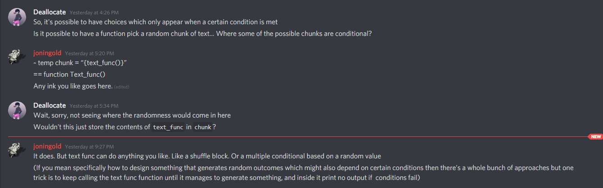

# Table of Contents

# Introduction

Ink has a fantastic community of Ink users that hang around on the Discord, answering questions and giving useful advice. This document is an attempt at gathering some of the collective wisdom from the Discord, to make it accessible to future (and present!) Ink developers.

It's strongly suggested that you don't read this document top to bottom: instead, feel free to flick through it at random, stopping only when something catches your interest.

If you're a total beginner and you've never touched Ink before - stop! There's better places to learn Ink from scratch - a good first stop is the [official Ink web tutorial](https://www.inklestudios.com/ink/web-tutorial/), which will teach you everything you need to publish a basic Ink game on the web.

Also, understanding what's going on in these examples will be much easier if you're familiar with the [Writing With Ink](https://github.com/inkle/ink/blob/master/Documentation/WritingWithInk.md) documentation - having it around so you can reference it is also a good idea. 

If you want to gain further insight into a section, an attempt's been made to provide links to the Discord conversations and relevant documentation wherever possible: these often provide additional context that might be useful if you want to deep dive into a concept. 

It's recommended that you have Inky running, so you can copy and paste examples straight into the interpreter and play around with them immediately: copying and modifying examples is a really good way to learn Ink! If an example doesn't work, or if you find a mistake in a section, (or if you're an Ink power user and think you could improve on an example), feel free to ping @southall on the #ink channel and they'll do their best to fix things.

Finally, it goes without saying, but if you're still feeling stumped, ask for help on the Discord! It's what it's there for!

*(Disclaimer: None of this content is Southall's, none of it belongs to Southall, except for the stuff that's wrong, in which case blame Southall. All the useful stuff? That comes from all the super smart people who hang out in the Discord. The [official Ink Patreon](https://www.patreon.com/inkle/posts) is also referenced quite a bit: most of these pages are free to access, but if you like using Ink, you should consider supporting them! There's some **really** useful pages behind the 2$ subscription.)*

---

# Ink Features - Tips and Tricks

In this section, we'll go through some of Ink's core features to have a look at some possibilities and patterns they unlock, as highlighted by users in the Discord.

# Variables and Logic

---

### How do I alter variables and other game stats in-text?

**Problem:**

You might have a stat or [Variable](https://github.com/inkle/ink/blob/master/Documentation/WritingWithInk.md#part-3-variables-and-logic) in-game that's very important, and gets manipulated a lot.

Let's say your player character has a certain amount of Gold at any time, and we want to be able to increase and decrease the amount of gold they have. 

You can do this by tracking the gold in a Variable and altering it using basic [Logic](https://github.com/inkle/ink/blob/master/Documentation/WritingWithInk.md#2-logic), but this isn't very efficient.

```
VAR gold = 7

I have {gold} gold.

* [I should buy a boat.]
    I buy the boat for 4 gold. 
    ~ gold -= 4 //(This is equivalent to 'gold = gold - 1')
    I now have {gold} gold.
    
* [I should buy a house.]
    I buy a house for 3 gold.
    ~ gold -= 3
    I now have {gold} gold.
    
* [I should try and get more gold.]
    I discover the alchemical recipe for making gold from lead.
    ~ gold += 5000
    I now have {gold} gold. That's a lot of gold I didn't have before.
    
    
- -> END
```

There's nothing inherently *wrong* with this - but it's annoying having to start a new line every time you want to alter the amount of gold, and can quickly get out of control, making your code look bloated and messy.

It's much better to write a function so you can alter variables in-line - this interferes way less with the flow of the writing, and is much easier to understand!

```
VAR gold = 7

I have {gold} gold.

* [I should buy a boat.]
    I buy the boat for 4 gold. {alter(gold, -4)} 
    I now have {gold} gold.

* [I should buy a house.]
    I buy a house for 3 gold. {alter(gold, -3)} 
    I now have {gold} gold. 
    
* [I should try and get more gold.]
    I discover the alchemical recipe for making gold from lead. {alter(gold, 5000)} 
    I now have {gold} gold. That's a lot of gold I didn't have before.
    
- -> END

=== function alter(ref x, y) ===
/*sets up a function where x is the variable to be altered, and y is the amount to alter by.
Note that the "ref" is important - it means you're actually passing in a variable to be altered!*/
    ~ x = x + y
```

Having the ability to throw your function into in-line text means you can combine it with [in-line shuffles and other random text possibilities](https://github.com/inkle/ink/blob/master/Documentation/WritingWithInk.md#sequences-cycles-and-other-alternatives).

```
VAR dogs = 2

I started life owning {dogs} dogs. 

* My rich aunt gave me a small gift of 1 million dogs to get started in the dog investment market. {alter(dogs, 1000000)}

-(loop) 
+ Time to play the dog stock market.
{~I lose 5 dogs! {alter(dogs, -5)} | Nothing happens. | Looks like I got 5 dogs! {alter(dogs, 5)} | Wow! ten dogs! {alter(dogs, 10)} }
 I now have {dogs} dogs in my portfolio!
-> loop

=== function alter(ref x, y) ===
/*sets up a function where x is the variable to be altered, and y is the amount to alter by.
Note that the "ref" is important - it means you're actually passing in a variable to be altered!*/
    ~ x = x + y
    
    
/* Concepts used:
Gather Loops
Functions
Shuffles */
```

*(Origin: [ArdentPurple and GrantRobertsArt's conversation.](https://discordapp.com/channels/329929050866843648/329929390358265857/449876588587122688) about setting vars in a shuffled list.)*

---

### Finding the biggest number out of a bunch of numbers. (Min & Max)

Let's say we have some [Variables](https://github.com/inkle/ink/blob/master/Documentation/WritingWithInk.md#defining-global-variables) with numbers stored in them, and we want to get the biggest number. (If you have some technical experience, you might recognize this as a simple Max functionality)

We [can use Ink's in-built MAX function for this](https://discordapp.com/channels/329929050866843648/329929390358265857/456835393845985301)!*(before you go look, it's not officially documented)*

```
VAR a = 1
VAR b = 7
VAR c = 2
VAR d = -3

{MAX(MAX(MAX(a, b), c), d)}
```

*(Origin: [joethephish on Discord](https://discordapp.com/channels/329929050866843648/329929390358265857/456835393845985301).)*

The MIN function does the opposite of MAX - instead of looking for the biggest of two values, it looks for the smallest instead.

---

### Storing Diverts in Variables

You can store a divert in a variable to be used later, which is pretty handy even on its own. 

In this example, the player is the regent of a doomed kingdom. No matter what, they'll be given the choice to `[Give Up]` and end the game, proceeding to a brief epilogue.

We use the variable `current_epilogue` to store *which* epilogue the game will choose to proceed to - if the player chooses to persist, we change the epilogue variable from `everybody_dies` to the slightly more desirable `bittersweet_ending` with a simple `~ current_epilogue = ->bittersweet_ending`.

```
VAR current_epilogue = -> everybody_dies

The Northern Armies are at your doorstep. Your trusted advisor betrayed you. Even the royal corgi has quit.

It's looking like this is the end of your reign.
-> continue_or_quit

=== continue_or_quit ===
Give up now, or continue striving for a better outcome for your Kingdom?
*  [Keep trying!]     -> struggle
*  [Give up]         -> current_epilogue

=== struggle ===
//Presumably a large chunk of gameplay goes here, where the player struggles to change the outcome.
[After a lot of gameplay and difficult choices, the player manages to get a better epiloque.]
~ current_epilogue = ->bittersweet_ending
-> continue_or_quit

=== everybody_dies
You chose not to struggle. And everybody died.     
-> END

=== bittersweet_ending
You lose some things. But you don't lose everything.

This is certainly better than the ending in which everybody died.   
-> END
```

*([example from DeviantDev](https://discordapp.com/channels/329929050866843648/329929390358265857/405323098963968002), with minor alterations)*

You can also use a variable to store a divert *as returned from a function*, which can lead to some useful patterns!

Here's a working example of everything in action.

```
LIST divertOptionsList = ElementA, ElementB
//We initialize the divert target variable with a placeholder divert that acts as a null value of sorts.
VAR currentDivertTarget = -> doNothing

//The game's eventual destination gets determined by feeding list elements into a function that returns divert targets, and stores them in a variable for later.
* Take Option A. 
    ~ currentDivertTarget = listToDivert(ElementA) 

* Take Option B.
    ~ currentDivertTarget = listToDivert(ElementB)

- ... //Some things occur before we get sent to the divert.

-> currentDivertTarget //And finally we send the story to the divert target we stored earlier.

=== function listToDivert(x)
	{ x:
		- ElementA: ~ return -> divertA
		- ElementB: ~ return -> divertB
		//etc.
	}
	
=== divertA ===
//Whatever's meant to happen in divert A.
...
-> DONE
=== divertB ===
//Whatever's meant to happen in divert B.
...
-> DONE

=== doNothing ===
//A placeholder knot that acts as a "null value" as sorts, since no proper null value exists for divertA. The game should never actually divert to this knot.
...
-> DONE
```

*(Ink Features Used: Knots, Diverts, Lists, Switch Statements, Variables, Functions)* 

*([Original discord link](https://discordapp.com/channels/329929050866843648/329929390358265857/400367817578381322).)*

---

### Variables can store (and call!) functions

Variables can store function calls as well!

We do this by storing the address of the function, treating it like a knot.

```
VAR func = -> knotName
{func("test")}

=== function knotName(thing)
~return thing
```

This might be more useful to you if you're a more advanced user.

One way this could be used is to pass a function that's run over a list, in order to filter that list.

TODO: Write an example for this.

*(Origin: [Irc, joethephish](https://discordapp.com/channels/329929050866843648/329929390358265857/471853192326414347))*

---

### Assigning conditional text based on numbers (switch statements!)

**Problem:**

What if we want to assign conditional text based on numbered input?

For example, let's say we want to print out a "Soup of the Day" based on the date.

In this scenario, we'd probably have a variable `WeekDay` that tracked the day of the week and returned a number between 1 and 5. (we could also have a function `WeekDay(x)` that took in a date `x` and returned the day of the week as a number, but for the purposes of this example, the two are identical)

**Solution:**

We could use a [switch statement](https://github.com/inkle/ink/blob/master/Documentation/WritingWithInk.md#switch-blocks) to decide this.

```
VAR WeekDay = 3

{ WeekDay:
    - 1: Potato Soup
    - 2: Tomato Soup
    - 3: Cream of Broccoli
    - 4: Clam Chowder
    - 5: Chile
}
```

*([Origin: wetcircuit and joethephish on Discord](https://discordapp.com/channels/329929050866843648/329929390358265857/460547672219320332))*

In order to blend this into text (so it says "The soup of the day is Tomato Soup"), we can use the Glue operator `<>` to "glue" these conditional blocks into our text.

```
VAR WeekDay = 2

~ WeekDay = RANDOM(1,5)

Ooh, it's <>
{ WeekDay: 
    - 1: Monday
    - 2: Tuesday
    - 3: Wednesday
    - 4: Thursday
    - 5: Friday
} 
<>!

The soup of the day is <>
{ WeekDay:
    - 1: Potato Soup
    - 2: Tomato Soup
    - 3: Cream of Broccoli
    - 4: Clam Chowder
    - 5: Chile
} 
<>.
```

Of course, if you're planning on using this pattern more than once, these conditional blocks are awfully inconvenient.

You might want to wrap them up in a [custom Ink function](https://github.com/inkle/ink/blob/master/Documentation/WritingWithInk.md#5-functions) like this:

```
VAR WeekDay = 1

Ah, it's {day_in_words(WeekDay)} today...

The soup of the day is {soup_of_the_day(WeekDay)}. Ah, well, you'll take it.

* Some time passes.
    ~ WeekDay = RANDOM(2,3)

    It's {day_in_words(WeekDay)} today.

- The soup of the day is {soup_of_the_day(WeekDay)}! You're pretty jazzed about it, you love your mid-week soups.

* You're coming up on the end of the week.
    ~ WeekDay = RANDOM(4,5)

    It's {day_in_words(WeekDay)} today.

    You glance at the menu board - {soup_of_the_day(WeekDay)} - meh. The weekend can't arrive fast enough.

-> END

// We could bundle this 
=== function day_in_words(DayInteger) ===

{ DayInteger: 
    - 1: Monday
    - 2: Tuesday
    - 3: Wednesday
    - 4: Thursday
    - 5: Friday
    - 6: Saturday
    - 7: Sunday
} 

=== function soup_of_the_day(DayInteger) ===
{ DayInteger:
    - 1: Potato Soup
    - 2: Tomato Soup
    - 3: Cream of Broccoli
    - 4: Clam Chowder
    - 5: Chile
    - else: Stone Soup
}
```

By wrapping up everything in functions, we can include the logic in-line, and everything becomes a lot cleaner and easier to re-use!

If you think you might need to use this pattern a lot, and not just for specific variables, t[his Ink Patreon post goes into detail](https://www.patreon.com/posts/ink-tips-indexed-19464546) about how you could achieve similar numerical indexing with a generalized in-line function. Alternatively, [this Ink Patreon post implements](https://www.patreon.com/posts/tips-and-tricks-20000902) something quite similar, matching arbitrary scores to words from a list.

---

## String Manipulation made Easy

[https://discordapp.com/channels/329929050866843648/329929390358265857/724592348993945681](https://discordapp.com/channels/329929050866843648/329929390358265857/724592348993945681) from gavinista, zavi, joozey, joningold

Let's say we want to assemble a string and assign it to a variable.

We might be tempted to start with something like this.

```csharp
VAR output = ""
VAR isCorrect = true

~output += "Something is "
{isCorrect: 
    ~output +=  "correct" 
-else: 
    ~output +=  "incorrect" 
}

{output}
```

We're best off assigning it to a function if we're doing it a lot.

```csharp
==test==
VAR output = ""
VAR isCorrect = true

~output += "Something is "
{isCorrect: {AddString(output, "correct")}|{AddString(output, "incorrect")}}

{output}

==function AddString(ref x, y)
~x+=y
```

The sweeter way is to use an in-line conditional like this.

```csharp
~ temp string = "Tell me {count > 0:more|less}"
```

---

## Miscellaneous Variables Tips

### Variable declarations can be written anywhere

VAR (and LIST) declarations can be written anywhere!

This means that the order in which you make variable declarations doesn't matter.

Which makes this:

```
== myKnot ==
VAR x = 5
blah with {x}
```

functionally identical to this

```
VAR x = 5

== myKnot ==
blah with {x}
```

So feel free to declare VARs and LISTs where it makes most sense to you!

*(Origin: [joethephish and Irc on the Discord](https://discordapp.com/channels/329929050866843648/329929390358265857/471675434833018891))*

---

# Lists

### What are Lists?

First things first: I**nk Lists are *not* your traditional programming List**. *(if you don't know what a List is in programming, that's cool! Feel free to skip this paragraph, this doesn't apply to you.)* **Ink Lists are *NOT* arrays**. This is a tricky topic, so before I try to explain them by paraphrasing other people, I'd like to point you to some other resources that might help you better understand Ink Lists. Your first stop should probably be the [Writing With Ink documentation on Lists](https://github.com/inkle/ink/blob/master/Documentation/WritingWithInk.md#1-basic-lists). This [Ink Patreon post about Lists](https://www.patreon.com/posts/tips-and-tricks-18636537) describes the nature of Lists in a succinct manner. [Jack Fractal from the Discord describes Ink Lists](https://discordapp.com/channels/329929050866843648/460525489895768085/589944904247934988) as "a map of booleans".

Alright. What IS a list?

In plain language, a list is a set of things that can be true or false, and has ordered elements. Think of a shopping list: items can be bought or not bought. 

To answer this question properly, we need to get a bit more technical [(this is largely paraphrased from Jon Ingold's explanation)](https://discordapp.com/channels/329929050866843648/329929390358265857/646282484866088981):

> A list is a a set of booleans, with numbers attached to them.

[Oddle's definition](https://discordapp.com/channels/329929050866843648/329932369530454016/643642679854366740) is also pretty good.

> Ink LISTs are not lists of anything, actually. They're sets of booleans with an associated integral value. They're weird and cool. But they don't "contain" other values than numbers.

### So why are Ink Lists useful?

[This paraphrased quote from Irc](https://discordapp.com/channels/329929050866843648/329929390358265857/461471520808501249) sums the usefulness of Ink Lists up pretty well:

> Lists are funny. 

Some things which are traditionally *very* hard to do with regular structures become very simple. 

But some things that used to be simple become somewhat clumsy.

Once you start wrapping your ahead around lists, you can start doing some really cool things with ease. Here's some examples of cool stuff people in the Discord have done with Lists.

- Created a tagging system for objects that label their properties (lightsource, copper, glass, breakable, climbable) and exposes those choices to players based on the properties of their inventory. So instead of needing a specific rope, the player only needs a rope like object. *([From the user called Irc](https://discordapp.com/channels/329929050866843648/329929390358265857/461472495610888202))*
- Organising information more compactly - if an object has a bunch of different states, you can record them in one place with a List!
    - e.g. `LIST BedsideLampState = (OnTable), OnFloor, (Lit), Unlit, Broken` stores five possible states a lamp could be in.  *(from Jon Ingold)*

### Is it possible to learn this power?

It's a bit of a cop-out answer, but the best way to learn how to use Inks is to start using them yourself. Run through the [Writing With Ink documentation](https://github.com/inkle/ink/blob/master/Documentation/WritingWithInk.md#1-basic-lists) and play around with the examples in Inky yourself.

When you're done with that, there's a whole load of stuff from the Inkle Patreon (a lot of it open to the public) that [gives examples of how you can use Inks for fancy stuff.](https://www.patreon.com/inkle/posts?tag=lists)

---

### A Basic State Machine using Lists (TODO: write explanation for example)

```jsx
LIST waterStates = frozen, cold, lukewarm, boiling, evaporated

VAR potState = frozen

-(loop)
The water in the pot is {potState}.

+ Heat up the pot.
    { potState < evaporated:
        ~potState ++
        You heat up the pot and the water changes state.
        -else:
        You can't heat the water up any further (unless you want it to become plasma).
        }
    -> loop

+ Chill the pot.
    { potState > frozen:
        ~potState --
        }
    -> loop

+ {potState != frozen} Flashfreeze the pot.
    ~ potState = frozen 
    You spray the pot with liquid nitrogen and the water inside instantly turns to ice.
    -> loop
```

---

### A basic item properties system using Lists

Here's a handy example from Jon Ingold.

In this game, the player has an inventory of items, some of which can be metal. Metal items can be given to an Iron Goblin to be eaten - how do we perform this conditional check?

With lists, this becomes quite easy.

```jsx
// A list of items the player could have in their inventory. The player is currently holding nothing, since none of the List elements are active.
LIST InventoryItems = Book, Amulet, Sword, Key
 
VAR MetalItems = (Key, Amulet, Sword)

* You pick up a sword.
    ~InventoryItems += (Sword)
    -> goblin_eat

==goblin_eat==
// Get the intersection of MetalItems with the items currently in the player's inventory with the ^ operator.
// Assign the first item in this intersecting list to "aCarriedMetalThing"
~ temp aCarriedMetalThing = LIST_MIN(InventoryItems ^ MetalItems)

* {aCarriedMetalThing} [ Give {aCarriedMetalThing} to Goblin]
   The Goblin eats the {aCarriedMetalThing}.  
   ~ InventoryItems -= aCarriedMetalThing

   ->DONE
```

(note that this example uses the `^` LIST operator in order to find the intersection of two lists and return it as a new list. [The relevant documentation for this can be found here.](https://github.com/inkle/ink/blob/master/Documentation/WritingWithInk.md#intersecting-lists))

*(Origin: [Jon Ingold in the Discord)](https://discordapp.com/channels/329929050866843648/329929390358265857/646282732389007360)*

---

### Getting the Length of a List

Do you need to get the length of a list?

```
LIST_COUNT(LIST_ALL(list))
```

6:29 PM]**joningold**:LIST_MAX(list) will give you the highest numerical value which is probably what you want (but isn’t necessarily the number of items, as you can assign values). LIST_COUNT will count members

[6:29 PM]**joningold**:Note you might need LIST_COUNT(LIST_ALL(list)) if you what the source list rather than the current state of that list

---

## A useful list popper construction

[https://discord.com/channels/329929050866843648/329929390358265857/800009184937639947](https://discord.com/channels/329929050866843648/329929390358265857/800009184937639947)

Jon Ingold: This is one of my favourite constructions, so here it is. First define a helper 'pop' function:

```jsx
=== function pop(ref list)
    ~ temp x = LIST_MIN(list)
    ~ list -= x
    ~ return x
```

This take the lowest element off the list, returning it.

Then you can do things like this:

```jsx
=== function ExclaimAboutItemsYourRoomateBoughtFromEbay(items)
    ~ temp item = pop(items)
    {item:
       "Oh, {~wow|man|super|cool}! {~You got|Here's} a {item}!"
       ~ ExclaimAboutItemsYourRoomateBoughtFromEbay(items)
    }
```

The {item: condition there is crucial to prevent an infinite loop, since pop returns () when you send it an empty list.

---

# -> Tunnels ->

## Tunnels vs Threads

"Tunnels take you where you were. Threads don't."

"Tunnels wait to be completed before they come back, threads don't."

### Why use Tunnels?

Tunnels are great when you want to introduce content that temporarily disrupts the flow of the story, and then returns to where it last left off.

An example of this [is if you have a character introduction](https://discordapp.com/channels/329929050866843648/329929390358265857/405325737420390400) that you know will be triggered when you meet that character (but not when or where you might meet them), [or perhaps](https://discordapp.com/channels/329929050866843648/329929390358265857/447729182957371393) "an interactive flashback that can occur in various different places in the story; or a tutorial the first time you talk to anyone", etc. 

Tunnels would be great for this!

Here's an example of how this might play out.

```
//Making my entrance again with my usual flair

/* This is a game in which the player can take a bunch of different routes. Some of them lead to the player meeting a clown character. We want to introduce the clown to the player, but we want to get back to the story immediately after we do so.

    This would be a good example of where we'd want to use tunnels!
*/

//For the purposes of this example, we're pretending that the player is playing through the career doubts knot. But they could just as easily meet Cassidy on the circus route knot.

-> career_doubts_route

=== career_doubts_route ===

You're moping around at home, worrying about your long-term career prospects, when a friend calls you.

"Hey - I know you've been down in the dumps lately. I've hired a specialist - someone who'll cheer you up."

Ten minutes later, your doorbell rings.

-> send_in_the_clown ->

* You feel a lot more content with your career having met Cassidy. 
    -> END
    
=== circus_route ===

What brings you to this small indie circus in an obscure corner of Leipzig? Who knows? But that is the fun of the circus - the surprise.

-> send_in_the_clown ->

* You spend the rest of the week dreaming of clowns.
    -> END

=== send_in_the_clown ===

* Preceded with raucous honking, and (you grudgingly admit), an unusual amount of flair, Cassidy the Clown makes their entrance.

They're a class act - the entire package. Rubber nose, throwing pies, banana peel gags: they've got it all.

You're awestruck. This is virtuosic clowning.

Before they leave, you insist on taking their business card.
//We can then track "send_in_the_clown" as a variable to see whether or not the player's met Cassidy before when writing other content.

->->
```

---

### You can divert out of tunnels

**Problem:**

Sometimes you might want to disrupt a [tunnel's](https://github.com/inkle/ink/blob/master/Documentation/WritingWithInk.md#tunnels-run-sub-stories) destination - maybe you don't want it to continue from where you last left off.

**Solution:**

You can disrupt a tunnel's destination by providing another divert after the normal tunnel "go on" statement `->->`.

```
=== tunnel ===
// this is a tunnel!
...
//This option returns us to where we were!
* Go back to where you left off.
	->->

//This option shunts us through to another divert instead!
* Wander off and do something new.
	->-> something_new
```

Here's an example of this in action.

```
You're lounging around at home, when a phone call comes in. 

-> engaged_in_phonecall ->

You get back to learning Ink.

-> END

=== engaged_in_phonecall ===

Oh dear. It's a telemarketer.

+ [Listen politely.] 
    -You listen politely as they try to sell you an intuitive scripting language. After a few minutes, you decline their offer and hang up.
    
+ You could get back to what you were doing originally. 
    ->->
+ Or...you could gather an army and start a crusade against companies that use telemarketing strategies.
    ->-> telemarketer_crusades_begin

=== telemarketer_crusades_begin

The war takes 20 years. Many innocents die. The world burns. Was it worth it?

-> END
```

TODO: WARNING: Doing this might be dangerous. Be very careful about where you shunt the tunnel. Without the guarantee that the tunnel is continuing where the story last left off, you could be shunting into a dead-end!  

[Link (syntax might be a little out of date)](https://discordapp.com/channels/329929050866843648/329929390358265857/392632497789337610)

---

### Threading Tunnels - threading content that's been written as a tunnel

You can actually thread in tunnels, as documented on the [official Heaven's Vault blog](https://heavens-vault-game.tumblr.com/post/166256097210/threading-tunnels).

> [This] can be useful because tunnels are portable - when they finish, they don’t need to know where to go back to, they just return - and threads allow the player to choose content from lots of different places in the source.

"Right. Tunnels are for content that has to happen (but might happen in multiple places); threads are for content that might happen".

"So [with threads] there's an implicit "if they do, then what?" which IMO is best explicitly surfaced, since "then continue from the middle of where you were before" isn't a great default.

"This hack really is an upgrade on passing a thread a return point and having to keep passing that return point around the whole time you're in the thread; it's def better than that!"

---

# <-Threads (UNDER CONSTRUCTION)

[Threads](https://github.com/inkle/ink/blob/master/Documentation/WritingWithInk.md#2-threads) can be gnarly, brutal little things to get your head around. If you haven't checked out [Tunnels](https://github.com/inkle/ink/blob/master/Documentation/WritingWithInk.md#1-tunnels) yet, you'll definitely want to know how to use them before you start playing around with Threads! Anyway, here's a collection of advice and examples on using Threads!

## Why use threads?

> **joningold:** If you can’t find a use for threads you probably don’t need them.

Threads can be complicated, and if you're just starting out, they can be way more trouble than it's worth. You can still write a really good Ink game without ever touching Threads! 

This said, Threads can be really useful for:

- [**Inserting the same choice(s)](https://discordapp.com/channels/329929050866843648/329929390358265857/404637762713550859) in multiple places.**
    - For example, you might want to give the player a chance to `Think about the clues we've already found.` at regular intervals in the game, but if you don't want to duplicate the code for `thinking_about_clues` every time you want to do this, you should use Threads.
- **[Keeping things tidy.](https://discordapp.com/channels/329929050866843648/329929390358265857/404637914983825409)**
    - Threads can help organize situations where you might have [a lot of choices in parallel](https://github.com/inkle/ink/blob/master/Documentation/WritingWithInk.md#example-organisation-of-wide-choice-points), or [dividing a physical room up into chunks of interactivity like in Heaven's Vault.](https://heavens-vault-game.tumblr.com/post/162943569425/using-ink-for-rooms-and-objects)

 "**joningold:** They’re invaluable for times when you want to insert the same choice(s) in multiple places. Heavens Vault relies on them for the conversation system; you’re acting in the world but there’s chat available wherever you happen to be, all the time."

### What ARE threads?

If Tunnels are structures that *interrupt* flow and stops at choices, Threads are structures that *collect* choices that are threaded in, and [adds them all to the end of the current flow](https://discordapp.com/channels/329929050866843648/329929390358265857/447680381836066816).

[//Add](//add) more about this

[9:42 AM]**joethephish**:](https://discordapp.com/channels/329929050866843648/329929390358265857/447680381836066816)Yeah that’s exactly what threads are for, non-blocking adding of flow

[9:43 AM]**joethephish**:One easier way to think of it that’s close to being accurate is as a “paste” of the content you’re threading in (but with all the choices collected at the botttom)

---

[9:45 AM]**isyourguy**:yeah, wasn't quite expecting the choices thing

---

[10:01 AM]**joethephish**:If you don’t want that behaviour then you just want a tunnel if you want the flow to come back again, or a normal divert if not

---

[10:17 AM]**joningold**:One way to think of tunnels / threads is exactly that distinction; does it stop at choices; or collect up the choices?

[Link](https://discordapp.com/channels/329929050866843648/329929390358265857/404637762713550859)

---

# Useful Design Patterns (UNDER CONSTRUCTION)

## Hubs

One of the most commonly used Ink patterns is the hub.

Basically, a hub is a piece of content that can be revisited over and over again, and serves as a place for the player to wander off and find new (or repeated) content. 

A useful example of this is the player's spaceship in the Mass Effect games. There's a lot of different content that the player can experience, but at the end of the day, they'll always be returning to the spaceship - which serves as a central hub. From this hub, the player can choose which content they want to experience next.

Of course, the hub concept doesn't just have to be spatial in nature. It can be applied to other content, like conversations.

Here's a great talk by Jon Ingold about writing effective dialogue using variations and progressions on the hub structure (among other things).

[https://www.youtube.com/watch?v=_vRfNtvFVRo](https://www.youtube.com/watch?v=_vRfNtvFVRo)

There's a whole bunch of ways you can implement hubs, and we're only covering a few here.

### Hubs - Looping through Choices until you escape

```
- (loop)
* You choose one choice.
* You choose another.
* But only this choice breaks the loop. -> break
- -> loop
- (break)
```

Suggested by [bruno](https://discordapp.com/channels/329929050866843648/329929390358265857/419212360566177803), this structure uses the fact that you can [Label gather points](https://github.com/inkle/ink/blob/master/Documentation/WritingWithInk.md#gathers-and-options-can-be-labelled) in order to loop through some choices until one choice breaks you out of the loop.  

This structure is useful because you can [count the number of times you've looped](https://discordapp.com/channels/329929050866843648/329929390358265857/419215780790403082), e.g. with `TURNS_SINCE(-> loop) == 0)`.

*(See: Labels, Gathers, Tracking and Visit Counts)*

---

### When you should use loops

> Anytime you find yourself typing the same code again and again, it's likely you can create a generic loop.

*([Advice courtesy of Spanks Masterson](https://discordapp.com/channels/329929050866843648/329929390358265857/434506774792503297))*

*(Origin: Conversation between Spanks Masterson and Lupus)*

---

### Structuring Rooms into "Chunks of Interactivity" with Threads (UNDER CONSTRUCTION)

[https://heavens-vault-game.tumblr.com/post/162943569425/using-ink-for-rooms-and-objects](https://heavens-vault-game.tumblr.com/post/162943569425/using-ink-for-rooms-and-objects)

5:04 PM]**LadyIsak**:i still want to figure out how to neatly package rooms into one knot

[5:04 PM]**LadyIsak**:and characters, too

5:04 PM]**joningold**:I do a lot of

```
=== room
Intro text.
-(top)
<- propA
//etc.
-> top
```

[5:05 PM]**joningold**:But they tend to exploooooode in size

5:08 PM] **joningold**: I usually stick propA in a stitch of the room@knot and just divert at the bottom of it to -> top

---

### Once-only Diverts (UNDER CONSTRUCTION)

**joningold**: A trick I’ve discovered recently is using fallback choices with the condition “CHOICE_COUNT()==0” on them, as that gives you a divert that’s implicitly once only

---

### Dynamic Choices in Hubs

Thomas has provided a succinct example enumerating a lot of ways you can make a loop-back hub dynamic and interacctive.

```csharp
- (labeledGather)
    This is text you only want to play the first time you hit this. 
    
-   (labeledGather_opts)
    //This content block can be made as dynamic as you like. 
*    Tell me something!
    Here's something...
    ->labeledGather_opts
*    Tell me something else!
    Here's something else...
    ->labeledGather_opts
+    Bye!
    See ya...
    
+   {CHOICE_COUNT()<3}This choice only appears if there's less than 3 choices above it. 
    
+   {labeledGather_opts>2}This choice only appears if you've looped at least 2 times.

+   {labeledGather_opts==1}This choice would only appear on your first time hitting these choices.

+   {CHOICE_COUNT()<1}This choice only appears when there's no other visible choices. 
    
    
-   (labeledGather_end)
    This is where you are forcing the story to if you haven't otherwise directly diverted elsewhere.
```

# Patterns that create the illusion of a persistent world

### How to rig up content that only happens once (or at random)

Sometimes you only want an encounter or game event to happen once, or only occasionally: think a one-off character moment, or a joke that's only funny when it happens the first time. 

In the example we'll be using, we want our player to get ambushed by a squirrel when they visit the scary woods for the first time: but we don't want this ambush to play out any more than once, because it'd get tiresome quickly.

We *could* test for this with the `woods` knot [visit conditional](https://github.com/inkle/ink/blob/master/Documentation/WritingWithInk.md#conditional-choices), but a much simpler way of triggering the tunnel would be using [in-line variable text](https://github.com/inkle/ink/blob/master/Documentation/WritingWithInk.md#types-of-alternatives) - `{-> encounter ->|}`.

The first time Ink sees `{->squirrel_ambush->|}`, it'll trigger the `squirrel_ambush` tunnel and play through the squirrel ambush content. But upon revisiting the woods, there's no tunnel for the sequence to trigger, just a blank - so nothing will happen.

Alternatively, if we want to acknowledge that the squirrel ambush occurred, we can write

 `{->squirrel_ambush->|You proceed carefully, worried about the possibility of further squirrel attacks.}`

Instead of doing nothing when the player revisits the woods, this sequence prints additional story text that acknowledges squirrel ambush has occurred - persistence, done cheap!

```
INCLUDE list_pairs.ink

-(crossroads)
You find yourself at a crossroads, just outside the woods.

+ Visit the scary woods.
-> woods 

=== woods ===
{->squirrel_ambush->|You proceed carefully, worried about the possibility of further squirrel attacks.} //The first time you visit the woods, it triggers a Tunnel to the squirrel ambush.
You're deep inside the scary woods. 

+ Return to the crossroads. -> crossroads

=== squirrel_ambush ===
A squirrel jumps out of nowhere and attacks you!

* Fight off the squirrel.
    You fling the squirrel away and flee deeper into the woods.
    ->->
```

If we wanted to trigger the squirrel ambush the third time we visited the forest, we could write the sequence differently as `{||->squirrel_ambush->}`. Or if we wanted to trigger different encounters in sequence, we could write something like `{->encounter_1->|->encounter_2->|}`

**Pattern Variations**

We could use [Shuffles or other variation methods](https://github.com/inkle/ink/blob/master/Documentation/WritingWithInk.md#types-of-alternatives) as well: `{~ ->encounter_1->|->encounter_2->}` will randomly choose between sending us through encounter 1 and 2.

And we can do this with other structures, like regular diverts, or even threads! 

`{~ -> PlayScene1 | -> PlayScene2 | -> PlayScene3 | -> PlayScene4 }` shuffles through a pile of 4 possible diverts, and sends us to one of them at random. *([suggested by andrew-mc](https://discordapp.com/channels/329929050866843648/329929390358265857/476549876214267916))*

To be clear: we *could* do this all using variables and the RANDOM() function - this way is just more compact, and generally less confusing once you get the hang of it.

*(Origin: [Ruber Eaglenest and joningold Discord conversation.](https://discordapp.com/channels/329929050866843648/329929390358265857/470153835361337355) a[ndrew-mc's suggestion.](https://discordapp.com/channels/329929050866843648/329929390358265857/476549876214267916))*

---

### Defensive Logic Design (TODO)

[GDC Talk - Narrative Sorcery - Jon Ingold, GDC 2017](https://www.gdcvault.com/play/1023989/Narrative-Sorcery-Coherent-Storytelling-in)

- Writing choices with defensive logic
    - Ad hoc
    - Preconditions
    - Fallbacks

- Building out the world model as a state machine

# Patterns for introducing variation and "randomness"

### Dice Roll Pattern

joethephish provides a pattern for randomly determining an outcome, similar to how one might [determine an outcome based on a dice roll.](https://discordapp.com/channels/329929050866843648/329929390358265857/432927540391182336) 

```
~ temp roll = RANDOM(1,6)
{roll:
    - 1: One
    - 2: Two
    - 3: Three
    - 4: Four
    - 5: Five
    - 6: Six
}
```

It's easy to throw diverts and functions on top of this pattern if you want to attach gameplay events to these randomized rolls. 

Here's an example where you throw dice in a loop, accruing money until you roll a 6 and win an all-expenses paid trip to Hawaii.

```
VAR money = 0

- (loop)
~ temp roll = RANDOM(1,6)
You currently have {money} dollars to your name.

+ Roll the dice!

{roll:
    - 1: One! You win one dollar! 
    ~ money += 1
    - 2: Two! You win two dollars! 
    ~ money += 2
    - 3: Three! You win three dollars! 
    ~ money += 3
    - 4: Four! You win four dollars! 
    ~ money += 4
    - 5: Five! You win five dollars! 
    ~ money += 5
    - 6: Six! Jackpot!!! You win a trip to Hawaii! 
    -> hawaii_trip
}
-> loop

=== hawaii_trip ===

* You spend a wonderful week in Hawaii.

-> END
```

---

### Using a function to randomly set a variable

If you want to pick a random element and store it in a variable for later usage, this is one possible pattern.

```
VAR x = ""
~ x = getName()

Their name is {x}! It's {x}! Remember the damn name!

=== function getName()
{shuffle:
    - ~ return "Jim"
    - ~ return "Jenny"
    - ~ return "Gina"
}
```

[Link](https://discordapp.com/channels/329929050866843648/329929390358265857/378585595640938507)

---

### Adding variation to repeated choices - aka stable shuffling with choice text

Some games might have conversations that will be revisited many times, and choices that will be taken repeatedly.

To make things seem less robotic, you might want to vary the choice text.

For example, you might want an option where the player says goodbye: and you might want them to vary between saying "Toodaloo", "Cheerio", and "Pip pip", even if the choice of saying goodbye is *functionally* the same each time.

T[his Heaven's Vault blog post](https://heavens-vault-game.tumblr.com/post/168006582140/ink-tip-stable-shuffling-for-choice-text) goes into detail about how you'd implement this. It's recommended you take a proper look at this post to learn how it works, but here's the code so you can copy and paste it into Inky to play with it.

```jsx
<i>You're interviewing Denise. She looks nervous. Guilty, even.</i> 
-> interview

=== interview

<- interrogation
<- finish_talking

-> DONE

=== interrogation
* Marlowe:  What were you doing the night of the murder? 
    Denise: It's none of your business. ->interview
* Marlowe: Can you explain the blood on your shirt?
    Denise: Knitting accident. Coulda happened to anybody. ->interview

=== finish_talking
{ shuffle:
    -   + Marlowe:    I'm done for now. 
    -> END
    -   + Marlowe:    That's all I wanted to ask you.
        Marlowe:    For <i>now.</i>  
        -> END
    -   + Marlowe:    I'm out of questions. 
    -> END
}
```

*(Taken from the Heaven's Vault blog. Note that we've made some changes to the syntax in the shuffle - for whatever reason, gathering to a divert at the end of the shuffle no longer seems to work, so we need to explicitly include the diverts for each variation now.*

### Structuring Big Chunks of Randomness




```jsx
=== function textResult()
~ temp text = "{~{testVar:Heads}|Tails}"
 { text == "": 
    ~ text  = textResult() 
 }
~ return text
```

# Implementing Meta-Structures (UNDER CONSTRUCTION)

<consider moving this to another section>

### Implementing "Groundhog Day" style time loops - "New Game +"

Let's say we want to let our player experience multiple playthroughs, but we want to retain certain variables across those playthroughs, to give a sense of progression or persistence (this is a common pattern - in a lot of games it shows up as New Game+, but it shows up in many shapes and sizes, like the Time Loops in Sorcery). 

[Discord discussion about implementing groundhog day mechanics in ink](https://discordapp.com/channels/329929050866843648/329929390358265857/598709561397870602)

Jon Ingold talks about a cross-game manager here 

[https://www.gamasutra.com/blogs/JonIngold/20200522/363472/Dreaming_Spires_Dynamic_Narrative_Layer_by_Layer.php](https://www.gamasutra.com/blogs/JonIngold/20200522/363472/Dreaming_Spires_Dynamic_Narrative_Layer_by_Layer.php) and here

[https://discordapp.com/channels/329929050866843648/679112803600171008/713517903646949386](https://discordapp.com/channels/329929050866843648/679112803600171008/713517903646949386)

> Anyway, so tutorials are an ink list; when one is shown we add it to the list, and finally we realised we could just record the state of the list at the end of game one and clobber it into the list at the start of game 2

> **[11:27 PM]** **joningold**: (Okay, we have done that before, actually; that's how the time loops in Sorcery 2 & 4 work.)

> **[11:27 PM]** **joningold**: but then of course we realised we could do the same thing for *any* of the tracking lists we use across the game

---

# "Query" patterns (UNDER CONSTRUCTION)

### Database Functions

**Problem:** You want items, or other objects in your game to have properties without having to add more global variables. You basically want a central repository of stuff where you can look up something to find some info about it. You want a DATABASE FUNCTION.

**Solution:**

Consider building a database function like this:

```
=== function itemProperties(item, property)
 { item:
- Lamp:
    { property:
    - Weight: ~return 3
  - Description: a handy table lamp
   }
- Towel:
    {property:
    - Weight: ~return 1.5
    - Description: a wet towel
    }
- Jewel:
    { property:
    - Weight: ~ return 0.5
    - Description: a mysterious jewel
    }
- Dog:
    {property:
    - Weight: ~ return 3
    - Description: an overweight daschund 
    }
}
```

*[(Origin: Jon Ingold, Discord)](https://discordapp.com/channels/329929050866843648/329929390358265857/646323630665367573)*

You can easily extend something like this, and it lets you do lots of fancy things, like relational 

```
LIST items = (Lamp), (Towel), (Jewel), (Dog)
VAR Weight = 0
VAR Description = ""
VAR sacredObject = ""

~ sacredObject = LIST_RANDOM(items) 
//Picking an item at random to be the sacred object.

You heft {itemProperties(sacredObject, Description)} into the air.

{itemProperties(sacredObject, Weight) < 1: Light as a feather!.}

{itemProperties(sacredObject, Weight) > 2: Geez, this thing's heavy.}

=== function itemProperties(item, property)
 { item:
- Lamp:
    { property:
    - Weight: ~return 3
  - Description: a handy table lamp
   }
- Towel:
    {property:
    - Weight: ~return 1.5
    - Description: a wet towel
    }
- Jewel:
    { property:
    - Weight: ~ return 0.5
    - Description: a mysterious jewel
    }
- Dog:
    {property:
    - Weight: ~ return 3
    - Description: an overweight daschund 
    }
}
```

[Discord Link](https://discordapp.com/channels/329929050866843648/329929390358265857/646323630665367573)

**Ink Patreon link about Database Functions**

[https://www.patreon.com/posts/tips-and-tricks-18667641](https://www.patreon.com/posts/tips-and-tricks-18667641)

### Multiple Conditionals across Multiple Lines

joningold: Note you can also put conditionals across multiple lines if you like (and I do like, and do this all the time). You can put separate conditions in separate {..}'s so long as they're all meant to be "and"ed together at the end

```
VAR afraidOfDogs = false
VAR dogAcquired = false
VAR animalFondness = 5

//

*     { not dogAcquired }
	    { not afraidOfDogs}
			{ animalFondness >= 4 }
			You decide to adopt a dog.
+ ->
			You decide that you aren't ready for the responsibility a dog entails.
```

---

### Taking a Value and Returning a Divert

This is a common pattern for a function that takes a value (e.g. from a list) and returns a divert.

Basically, you can get an index of things you might want to divert to.

```
=== function listToDivert(x)
	{ x:
		- ElementA: ~ return -> divertA
		- ElementB: ~ return -> divertB
		//etc.
	}
```

**joningold:** [This isn't] exactly elegant but it serves its function and acts as a kind of "index" which has some advantages ; e.g. if you change a knot name you'll get compile time errors rather than runtime ones.

(*Origin: [Link](https://discordapp.com/channels/329929050866843648/329929390358265857/371578106575847424) to discussion between chrysoula and joningold)*

---

# Reacting to game-state and generating procedural text

## Tracking and Reacting to what the player's experienced

### Tracking Knots!

It's worth noting that every [Knot](https://github.com/inkle/ink/blob/master/Documentation/WritingWithInk.md#3-knots) in the game can be [tested with conditional logic](https://github.com/inkle/ink/blob/master/Documentation/WritingWithInk.md#conditional-choices) to see if the player's visited it before. If you have a knot called `Paris`, you can use the knot name with conditional logic to see if the player's ever visited the `Paris` knot before: 

`{Paris: I've been to Paris!|I haven't been to Paris.}` 

The above will return `I've been to Paris!` if that knot's ever been visited, and `I haven't been to Paris` if it's still unvisited.

Here's a fuller example of how we might check for content a player's seen before.

```
In your youth, you once visited...

* ...Paris 
-> Paris_flashback -> 
* ...London 
-> London_flashback ->
* ...New Orleans 
-> New_Orleans_flashback ->

- Fifty years later, your grandchild is sat on your lap.

"Have you ever been to Paris before?" they ask you.

* {Paris_flashback} "Why yes, I have been to Paris," you proudly reply.
    "I remember it very fondly."
    -> END
* {not Paris_flashback} "No, I've never been to Paris," you sheepishly reply.
    You both sit in awkward silence for the rest of the afternoon.
    -> END

=== Paris_flashback
The nights in Paris were long and filled with wine.
->->

=== London_flashback
London was where you first fell in love with floral teas, and where you had your first kiss.
->->

=== New_Orleans_flashback
In the wet heat of New Orleans, you learned about persuasion and kindness from streetside charlatans and cooks in Cajun diners.
->->

/* Concepts used:
Tunnels
Conditionals
*/
```

---

### Tracking in more detail - Stitches and Labels (UNDER CONSTRUCTION)

If you want to track visited content in more detail than just Knots, Ink lets you track [Label](https://github.com/inkle/ink/blob/master/Documentation/WritingWithInk.md#gathers-and-options-can-be-labelled)s and [Stitch](https://github.com/inkle/ink/blob/master/Documentation/WritingWithInk.md#6-includes-and-stitches) visits as well. This often gets used when using labels to create looped hubs.

---

### Tracking Choices

We can track choices by labelling them, and then tracking those labels.

```
* (a) choice A
* (b) choice B
-
{a:You picked A}
{b:You picked B}
```

*(joethephish on the Discord)*

Here's a more detailed example from [Writing with Ink](https://github.com/inkle/ink/blob/master/Documentation/WritingWithInk.md#advanced-all-options-can-be-labelled) which demonstrates how this could be useful.

```
-> fight_guard
=== fight_guard ===
You're facing a guard. -> throw_something
= throw_something 
*	(rock) [Throw rock at guard] -> throw
* 	(sand) [Throw sand at guard] -> throw

= throw
You hurl {throw_something.rock:a rock|a handful of sand} at the guard.
-> END
```

*(From Writing With Ink, altered slightly so it can be copy and pasted directly)*

---

### Advanced tracking: visit counts

As [Writing with Ink notes](https://github.com/inkle/ink/blob/master/Documentation/WritingWithInk.md#advanced-knotstitch-labels-are-actually-read-counts), when you're testing Knots and Labels as conditions, you're not just testing whether they're true or false: you're actually testing *the number of times* the player has been to that content!

In this example, we use visit counts to track the number of times a player's been to the chocolate store, and alter the text according to how much of a chocaholic the player has become.

```
- (loop)
+ Go to the chocolate shop{chocolate_shop: again}.
	-> chocolate_shop ->
	-> loop
=== chocolate_shop ===

It smells of rich cocoa in here, and it is heavenly. 

+ The shopkeeper greets you with a {chocolate_shop <= 5:quiet|slightly worried} smile. 

{
- chocolate_shop == 1: "Let me know if I can help you with anything, and I'll be right with you."
- chocolate_shop > 1 && chocolate_shop <=3: "Ah, it's good to see you again. Anything in particular in mind?"
- chocolate_shop > 3 && chocolate_shop <= 5: "Always happy to see one of my favourite customers. Will it be the usual again today?"
- chocolate_shop > 5: "I don't mean to be rude, but if you want, I can put you in contact with my usual wholesaler. Frankly, our other customers need to buy chocolate from us too."
}

//Note that this is an if-else block, so we need to be careful about how we write the conditions. The logic goes down the test by test, and runs on the first conditional test that passes: so if you have a very general conditional test early on in the block, more specific tests further down might never get run. Order matter!

-   You peruse the store for a bit, and leave with a large assortment of chocolates.

->->
```

This is especially useful for responding and rewarding the player for seemingly unusual behaviour: if the player's fond of visiting a particular piece of in-game content, having a character add an offhand remark about it is easy:

`"So anyway, it turns out my date was nuts about penguins - they wouldn't talk about anything else.{aquarium.penguins > 5: Come to think of it, don't you have a penguin obsession too?}"` 

(this statement produces an additional quip if they've visited the `penguins` stitch or label within the `aquarium` knot more than five times)

### Advanced tracking: Turns since visiting a piece of content (UNDER CONSTRUCTION)

The in-built [TURNS_SINCE(->knot) function](https://github.com/inkle/ink/blob/master/Documentation/WritingWithInk.md#turns_since--knot) is super useful for tracking *if* and *when* a player last visited some content. 

[From the Ink Patreon (open content)](https://www.patreon.com/posts/tips-and-tricks-18637438)

---

### Using visit counts with knots and labels is a little different

**Problem:**

*(Unless you want more detail on how Knots and Labels differ, or you've encountered issues with visit counts and looping Knots, you can probably skip this section.)*

You can track Knots and Labels, but the way they *get* tracked is actually slightly different. If you've ever encountered issues with knot looping and visit counts, you've probably written something like this:

```
-> Test
=== Test
We've revisited the test knot {Test} times.

+ {Test < 3} Option 1
+ {Test >= 3} Option 2

- -> Test
```

This *looks* like we should get Option 1 three times, and then get shown Option 2 once we've looped through a third time - but when we run the code, we only get shown Option 1.

**Solution (and explanation):**

Why is this? Well, it's because Knots are a little bit like containers. In this loop, we never actually *leave* the `Test` knot, so as far as the game is concerned, we're still on our first visit to the `Test` knot no matter how many times we go through the loop.

If we wanted the `Test` visit count to increment properly, we might rewrite the example like so:

```
-> Test

=== Test
We've revisited the Test knot {Test} times.

+ {Test < 3} Option 1
+ {Test >= 3} Option 2

- -> OtherKnot

=== OtherKnot
-> Test
```

In this example, our loop diverts us to a knot that *isn't* `Test` - so we leave the container that is `Test` knot, and when we re-enter it, the visit count increments properly.

**But labels don't encounter this visit count looping issue - why is this?**

If you've tried looping with Labels, you might have noticed they don't encounter this problem. That's because Labels work a little differently from Knots.

> If Knots are like "large containers", Labels are more like "gates" that you pass through.

*([joethephish](https://discordapp.com/channels/329929050866843648/329929390358265857/475278597997854721))*

Because labels work like gates, we don't need to divert the loop anywhere else to increment the visit counts properly: if we've diverted to the label, we've "passed through the gate", and everything will be have as expected!

```
- (Test)
We've been through this loop {Test} times.

+ {Test < 3} Option 1
+ {Test >= 3} Option 2

- -> Test
```

*(If this was confusing, try looking up these concepts: Tracking, Visit Counts, Loops, Labels)*

*(Origin: [joethephish](https://discordapp.com/channels/329929050866843648/329929390358265857/475278597997854721), DeviantDev, andrew-mc)*

---

### Commenting on game state in an exhaustive manner

... A useful and elegant pattern for checking and commenting on a world state, [courtesy of Isani.](https://discordapp.com/channels/329929050866843648/460525489895768085/591191400180350986)

```jsx
== comment_on_alpha_and_beta

* {not alpha and not beta} ->
    You should get started with alpha or beta.

* {alpha and not beta} ->
    You've done alpha, at least. Now how about beta?

* {beta and not alpha} ->
    You've got beta, now do alpha.

* {alpha and beta} ->
    You've done all you can about alpha and beta.

// No comment
+ ->

- ->->
```

- 

    ```csharp
    VAR alpha = false
    VAR beta = false

    -(journey)
    + Continue on your journey
    + Do alpha.
        ~ alpha = true
    + Do beta.
        ~ beta = true
    -
    -> comment_on_alpha_and_beta -> 
    -> journey

    == comment_on_alpha_and_beta

    * {not alpha and not beta} ->
        You should get started with alpha or beta.

    * {alpha and not beta} ->
        You've done alpha, at least. Now how about beta?

    * {beta and not alpha} ->
        You've got beta, now do alpha.

    * {alpha and beta} ->
        You've done all you can about alpha and beta.

    + -> 

    - ->->
    ```

*(Origin: [Isani](https://discordapp.com/channels/329929050866843648/460525489895768085/591191400180350986))*

---

### Creating relationships by pairing list items together (UNDER CONSTRUCTION)

So this is essentially a description of a [Patreon post](https://www.patreon.com/posts/tips-and-tricks-19789721) that's locked behind a paywall.

But it is horrifically powerful, and absolutely worth the 2 dollars it'll take you to access it.

<describe why TK>

[Jon Ingold talking about pair storing code in discord](https://discordapp.com/channels/329929050866843648/329929390358265857/583603971701342228)

---

### Dynamically assigning pronouns (UNDER CONSTRUCTION)

**Problem:** 

We have a piece of text "The cat sits in {Character's} lap, which makes {them} very happy."

Different {character}s will use different pronouns - `The cat sits in Mr. Darcy's lap, which makes him very happy.` requires the usage of different pronouns from `The cat sits in Ms. Hathaway's lap, which makes her very happy.`

TODO: write this section out. Gonna have to find the discussion from the discord on this topic (again. Can't believe i lost it)

Basically a pointer to [this patreon post](https://www.patreon.com/posts/tips-and-tricks-18667641) about using functions + lists as databases.

You can then [use post-processing to handle stuff like capitalization](https://discordapp.com/channels/329929050866843648/329929390358265857/466354763513069569).

---

## Multiline Conditional Blocks

Sometimes we may want to combine multiline shuffles or once blocks with conditionals! This is possible, with some tweaks.

```
VAR angry = true
VAR wantToDance = false

-(reshuffle)
{shuffle:
    - {wantToDance: To PULL SHAPES!|->reshuffle}
    - {angry && wantToDance: All I want to do is dance angrily!|->reshuffle}
    - To go to the club... //You need a fallback here, even if it has nothing in it.)
    }
    
    
Tonight, all you want to do...

+ ...is...
    -> reshuffle
```

By providing alternatives that reshuffle the block if a condition isn't met, we prevent the block from spitting out empty blocks of text.

Source: me.

---

# Keeping your script tidy and writing Ink efficiently

### Why you might need this section

As your game grows, your Ink script is gonna become pretty huge. The Ink game 80 Days had [750,000 words](https://discordapp.com/channels/329929050866843648/329929390358265857/397432823901847562)! 

When you notice your script becoming unruly, you're going to start using certain tricks and patterns to keep things organized and in check.

---

### Separating your Ink files with Include

**Problem:** So, your project is 4,000 words long, and you're starting to dread scrolling through to find the bits that you want. What do you do?

**Solution:**

Write your story using Ink's [INCLUDE](https://github.com/inkle/ink/blob/master/Documentation/WritingWithInk.md#script-files-can-be-combined) functionality!

By sticking a bunch of include statements at the top of your Ink file, you can split your ink story across multiple files to organize things better.

```
INCLUDE introduction.ink
INCLUDE conversations/rich_aunt_sally.ink
INCLUDE conversations/uncle_joe.ink
```

In the Inky editor, the result is something that looks like this:


Note that this doesn't affect namespacing at all. You can divert to a knot in `[introduction.ink](http://introduction.ink)` exactly the same as if that knot was in the main story file.

Splitting the story up into separate files is *purely cosmetic* and is for our own organizational purposes only. All an `INCLUDE` statement does is sticks the referenced files into the code where the `INCLUDE` statement happened. A big 750,000 .ink file is functionally identical to a project that's split the same text into 75 different .ink files using INCLUDE. The only difference is that the project using INCLUDE is way easier to manage!

**WARNING!
DO NOT LEAVE INCLUDE FILES BLANK.
THERE IS A SERIOUS INKY BUG [THAT WILL EAT YOUR STORY ALIVE](https://discordapp.com/channels/329929050866843648/623109387283595264/626403819097554944) IF YOUR INCLUDE FILES ARE LEFT BLANK.
TYPE A COMMENT `//` OR PUT ANYTHING INTO YOUR INCLUDE FILES BEFORE YOU SAVE THEM. 
JUST MAKE SURE THEY AREN'T BLANK!**

*(Origin: [Oddle](https://discordapp.com/channels/329929050866843648/329932369530454016/601427808480264193), [Wetcircuit](https://discordapp.com/channels/329929050866843648/623109387283595264/626403819097554944))*

---

## Using (and abusing) Inky's Autocomplete/Intellisense to make writing easier

If you're using Inky, you might have already noticed that its Autocomplete/Intellisense feature is very useful.


If this is new to you, don't worry! You can use autocomplete by beginning to type out the name of a function, variable, or other keyword that exists within your story, and pressing "Tab" to auto-complete the entry. You can also use the arrow keys to manually select which entry you want to auto-complete to from the drop-down list!

### Using Autocomplete to help you remember knots and variable names

 Autocomplete is really handy for handling large projects where it's impossible to memorize the names of all the knots and stuff. One trick [Jon Ingold recommends](https://discordapp.com/channels/329929050866843648/329929390358265857/591515952521412608) is deliberately using prefixes in your naming patterns to get the most out of autocomplete.

Let's say we have a huge game where a character travels around the world in [80 days.](https://www.inklestudios.com/80days/) We might have hundreds of different locations, each with their own knots and labels - it would be an impossible task to memorize all of these addresses by heart! This would be especially problematic when it comes to referencing past events that happened in other countries - what if we wanted to include a reference to an unfortunate Parisian incident involving mimes while we were in Bolivia, but couldn't remember the specific name of that knot? 

The answer is to be deliberate about your namespacing. A good choice is to preface knots and variables with prefixes that help tie them to specific content: for example, we might store our Parisian mime incident under `paris_mime`.

The next time we want to reference a knot in Paris, we simply start writing our code and enter `paris` - and voila, Inky will suggest a bunch of relevant divert targets for us!


Very handy in a story that could possibly have thousands of knots and variables to sift through!

*(Origin: [Jon Ingold, Mischawake, Oddle conversation about autocomplete.](https://discordapp.com/channels/329929050866843648/329929390358265857/591515952521412608))*

### Hacking Intellisense to provide autocompletion for tags

If you're doing stuff with [tag parsing](https://github.com/inkle/ink/blob/master/Documentation/WritingWithInk.md#tags), you might find yourself writing stuff like `#character_portrait_frowning` a lot, which can get annoying if you need to write it out in full every time.

Luckily, there's a way to trick Autocomplete into completing these for you!

[ThomasFromCoffeeBoxGames found a really handy hack](https://discordapp.com/channels/329929050866843648/329929390358265857/575375422863179811) for this - I'll quote them wholesale.

> It's a simple thing, but after getting properly stuck into pacing emote tags throughout dialogue scenes, and trying to think of quality of life improvements for the content production process, I figured out that by simply chucking a character's emote tags as plain ink into its own ink file, the tags will turn up in Inkle's intellisense!

Has definitely helped me speed up iteration times, experimenting with different emotes across different lines of dialogue etc. Hope this helps someone!


*(Origin and images: [ThomasFromCoffeeBoxGames](https://discordapp.com/channels/329929050866843648/329929390358265857/575375422863179811))*

---

### Adopting good name-spacing practices

[This is a useful discussion](https://discordapp.com/channels/329929050866843648/460525437282680853/558951819947278346) from the Discord about namespacing in Ink, given that Ink mainly uses global variables. As an Ink project gets bigger, its global namespacing can lead to a lot of nasty clashes where the writer accidentally re-uses the same name for different things - like functions and variables. 

*(Origin: This d[iscussion here](https://discordapp.com/channels/329929050866843648/460525437282680853/558951819947278346))*

---

## Organising lots of conditionals neatly (UNDER CONSTRUCTION)

Sometimes you want to be able to offer up a load of choices to the player, and filter them based on conditions. This can get messy - here's a pattern that Jon Ingold uses for keeping conditional choices readable.

- go over the pattern where you can stick a whole bunch of conditionals on new lines and still have them work
    - like so

```jsx
* {rabbit_eaten}
	{TURNS_SINCE(->hunt)==0}
	{alpha and beta}
```

I know Jon mentioned this SOMEWHERE in the discord - I just can't find it right now. Urgh.

---

## Why use stitches?

User Gavinista had some useful input on how to use stitches:

I actually use stitches for precisely the purpose Sappho is trying to accomplish

```
==paris
"Where to, monsieur?"
<-home
+"La biblioteque!"
+"Le Musee du Louvre!"

=home
+"Take me home."
->home_choice
```

The downside of this is that the 'default' choices end up always being at the top of the choice list instead of the bottom... which I've been changing on Unity's side.

You can also have multiple "home_choice"s stitches within different knots so you can always divert to home_choice and expect to see whatever variations of choices you put in

# Testing your Game

Once your game gets to a certain size, you're often going to want ways to test and debug problems. Here's a bunch of tips and tricks for testing from the Discord!

---

### Making random things less random - setting RNG seeds

When you're testing things, it's inconvenient if random shuffles and functions keep changing every time you revisit the game. Setting a [random seed](https://github.com/inkle/ink/blob/master/Documentation/WritingWithInk.md#seed_random) with `~SEED_RANDOM(7)` or some other arbitrary number will "set" the random number generator, making it easier to test random content!

*(Origin: [joethephish)](https://discordapp.com/channels/329929050866843648/329929390358265857/472470398357995540)*

---

### Unit Testing

DeviantDev [suggests an informal way](https://discordapp.com/channels/329929050866843648/329929390358265857/404365022631034880) to hash out "player experience" unit tests so you can make sure your game's playing out the way it is.

> **DeviantDev:** [...]
Make a little mini-timelines on paper of specific choices you imagine for your story, what the variables will do based on those, and how those variables would then affect choices later on. 
Like little unit tests for the player experience.
Later, once you have the script up and running, you can follow those timelined choices and see if you end up with the result you are looking for.

---

### Testing by bashing randomly through your game with a javascript prototype (UNDER CONSTRUCTION)

[https://heavens-vault-game.tumblr.com/post/161317718670/prototypes](https://heavens-vault-game.tumblr.com/post/161317718670/prototypes)

---

# Tips related to running your ink and front-end stuff (with JS, Unity, etc.)

---

### Can I display greyed-out/locked choices that aren't currently possible?

In Twine, there's the option to display "locked" choices that aren't available because the player hasn't met certain conditions: they're displayed as greyed out links that can't be clicked, but are still visible.

Long story short, unfortunately [there's no native support for this  in Ink](https://discordapp.com/channels/329929050866843648/329929390358265857/401652158149165056) - mostly because of how failed conditional options in Ink don't get any output by default. If you want to implement "impossible choices", [external shenanigans](https://discordapp.com/channels/329929050866843648/329929390358265857/401652158149165056) may be necessary - you might have to get Unity or whatever front-end you're using to do the "locking" for you.

It may be worth considering *why* you want to display choices the player can't take from a design perspective: [teasing the player with what they can't do isn't always fun](https://discordapp.com/channels/329929050866843648/329929390358265857/401664697990119425), especially if it's because they didn't complete some obscure task a few hours ago. 

That's not to say this design choice doesn't have valid applications: the game [Birdland](https://birdland.camp/), for instance, uses "impossible choices" to show how the teenage player character's mood might constrain her actions. Unfortunately, you might have to get a little creative in Ink if you decide this type of design is a crucial part of your game.

It appears that [Lilytastic has solved this problem](https://discordapp.com/channels/329929050866843648/329929390358265857/401887157892939789) by making every choice visible and using post-processing to decide whether a choice should be hidden. 

[Ringlas also has their own post-processing solution](https://discordapp.com/channels/329929050866843648/329929390358265857/402152857958350859) that's rather elegant, and provides an example of how the Ink code might look [here](https://discordapp.com/channels/329929050866843648/329929390358265857/402231400012447775) (and Jon Ingold summarizes the same approach later on [here](https://discordapp.com/channels/329929050866843648/329929390358265857/443838608613310464)). There's a long and useful conversation that follows that link about locked choice implementation.

Which is to say, if you want locked choices, go for it! You'll just have to do some front-end stuff, which falls outside the scope of this documentation.

---

### Fading prior text when working with javascript (UNDER CONSTRUCTION)

[https://discordapp.com/channels/329929050866843648/329929390358265857/451647861827043348](https://discordapp.com/channels/329929050866843648/329929390358265857/451647861827043348)

8:20 AM]**thefader**:I want to fade (change the opacity) of the previous text when the new text appears. How can I do that in a simple way with JS?

[8:27 AM]**joethephish**:**@thefader** add a class to the previous paragraphs? (Or remove a class once a new one is no longer new) then do it with CSS transitions?

[8:58 AM]**thefader**:**@joethephish** Thanks! I'd appreciate a lot if you give an example of doing that with adding a class to the previous paragraphs.

[8:59 AM]**joethephish**:see the choice code in main.js

[8:59 AM]**joethephish**:`var existingChoices = storyContainer.querySelectorAll('p.choice');`

[8:59 AM]**joethephish**:that's how you grab a list of content

[8:59 AM]**joethephish**:here's an example of adding a class:

[8:59 AM]**joethephish**:`choiceParagraphElement.classList.add("choice");`

---

### Can you can sneak css into the ink file itself? (UNDER CONSTRUCTION)

Apparently so!

[https://discordapp.com/channels/329929050866843648/329929390358265857/439082195903053835](https://discordapp.com/channels/329929050866843648/329929390358265857/439082195903053835)

[4:16 PM]**joethephish**:a good way to do that is to use ink tags

[4:16 PM]**joethephish**:`Your content # h4`

[4:17 PM]**joethephish**:then in the JS file, pick up the tag and turn it into HTML

4:21 PM]**joethephish**:or even better, you could make the syntax

[4:21 PM]**joethephish**:`Your content # <h4>`

[4:22 PM]**joethephish**:then you could detect that it's an HTML type thing

[4:22 PM]**joethephish**:then in your template JS do something like

```
// Get ink to generate the next paragraph
            var paragraphText = story.Continue();

            var elementType = 'p'; // default
            var tags = story.currentTags;
            if( tags ) {
                for(var i=0; i<tags.length; i++) {
                var tag = tags[i];
                if( tag && tag[0] == "<" )
                    elementType = tag.substring(1, tag.length-1);
                }
            }

            // Create paragraph element
            var paragraphElement = document.createElement(elementType);
```

---

### Saving and Loading Content externally

Here's a [discussion about how Ink handles saving and loading from 2018.](https://discordapp.com/channels/329929050866843648/329929390358265857/469149170629083137)

---

### When to use tags vs when to use external functions

As of Ink's current 1.0 update, this is no logner  

Paraphrasing Jon Ingold:

- External functions can be called multiple times per Continue call.
    - So tags are good for post computation stuff
- External functions are better for decision making in the flow

[Discord link](https://discordapp.com/channels/329929050866843648/329932369530454016/493408596726382602)

---

### Manipulating Upper and Lower Case printing for Variables

**Use Case:**

You want to manipulate the case of a variable (e.g. if you've stored "swarm of rats" as `X`, and you want it to it print as "Swarm of rats" when it's at the start of a sentence and needs to be capitalized, "swarm of rats" everywhere else, and "SWARM OF RATS" when stuff gets dicey.

**Solution:**

You might want to use an [external function call](https://github.com/inkle/ink/blob/master/Documentation/RunningYourInk.md#external-functions) (e.g. to Unity) to perform this sort of string manipulation. 

Otherwise, you might want to try using a **database function** (see elsewhere in this document).

---

### Parsing and displaying dialogue

[Useful additional tip from jack fractal about using >>dialog start tags.](https://discordapp.com/channels/329929050866843648/329929390358265857/649399963687845926)

---

## C#/Unity Stuff

This is mostly just going to be links to conversations in the discord: my assumption is that if you're integrating C# with Unity, chances are you're pretty self-sufficient, and just need to be pointed in the right direction.

### Is it possible to reach inside Ink and toggle a LIST value from C#?

Yes! See [this conversation between](https://discordapp.com/channels/329929050866843648/329929390358265857/478488381181919233) colin_coin_coin and joethephish for implementation details.

### Debugging in Unity

If you're using the [Unity integration package](https://assetstore.unity.com/packages/tools/integration/ink-unity-integration-60055) to develop with Ink+Unity, it has a feature called the ink player window, which helps you track and manipulate variables for testing, among other useful things. There's a bunch of other debugging features which seasoned programmers will probably find invaluable.

If you're subscribed to the inkle patreon, this subscriber-locked [patreon post](https://www.patreon.com/posts/20935866) has some pointers on getting you started with the ink player window.

### What to do instead of lookaheads

Sometimes we want to pump out text or change the gameplay state based on the Ink story, without affecting the state of the actual story.

Jon Ingold states:

>I missed all this because it’s in the engine dev channel (!) but there are easier ways that use a single story which is way more stable
Eg if combat has no choices and just generates text, use EvaluateFunction to call an ink function from code. You can send in parameters and capture its output, and it doesn’t touch the position of the main narrative flow
We do this everywhere in all our games
If combat has choices you can’t use a function and have to be more clever - we do this for translation in heavens vault
>
>Go into a tunnel; then use -> DONE to pause the story flow mid tunnel ; then use ChoosePathString to choose the combat knot; run it until it’s finished (using -> DONE again); then ChoosePathString to run an “end of translation” knot which basically just does ->-> and returns you back to wherever you came from in the main narrative
>
>But you shouldn’t ever need to have multiple ink stories and it’s usually a bad idea

(https://discord.com/channels/329929050866843648/721383859970900009/793558383457992704)


## Using buffering for your text boxes

[https://discord.com/channels/329929050866843648/329932369530454016/798982554878476288](https://discord.com/channels/329929050866843648/329932369530454016/798982554878476288)

(Inkimu36)

This is where buffering helps. Continue() consumes one chunk at a time, so it's probably the approach that works best for your game.

A. You can program your UI text box so it buffers input and then only outputs an amount it can fit. This is where old RPGs show the V arrow icon to prompt pressing A or enter. It lets you ContinueMaximally().

B. You can structure your ink to only output one message box sized text at a time. Then Continue() works. This is easy to write, but very hard to test and debug. You will make mistakes, and some of your lines will be too long.

C. Use Continue(), but load the result into a buffer and automatically insert V arrow icons to read the next words that fit in the box until the box is empty. This is better than A, but has the benefits of B.

# Other Miscellaneous Tips

---

### Localization

**Problem:**

I want to translate my Ink game into other languages.

**Solution:**

Localizing Ink files into other languages isn't impossible, but it is currently very difficult.

paulloz of [Bury Me My Love](http://burymemylove.arte.tv/) has had the most experience with localizing Ink files. In their words:

> **paulloz:** it was painful

There you have it.

Jokes aside, [this Discord conversation](https://discordapp.com/channels/329929050866843648/329929390358265857/484615214852079616) might have some useful pointers for how one might go about tackling the localization problem. 

---

# Doc writing notes

A useful pattern/tip template for writing out sections

### Pattern Template

- An introduction to the pattern in broad strokes.
    - How is the pattern useful for an Ink game?
    - Give examples of the pattern from existent games and media (or real life).

**Working Example**

- Give a fully functioning example
    - The reader should be able to copy and paste it straight into Inky and run the example.
        - If an additional INCLUDE is required, it should be linked and immediately accessible, and it should be clearly stated that an INCLUDE is required.
    - Try to step the reader through what the code is doing.
        - You can refer them to other documentation for additional context, but there are some syntax usages in Ink that are non-obvious.

**Variations on a Theme**

- Give ideas and examples of how a reader might extend a pattern in complexity, or with other Ink features.
    - Give examples of how a pattern might be used in non-obvious ways.
- Relate this back to

**Sources and Additional Reading**

Sources: Originating discord links with the names of users involved in that discussion, links to blogs or articles (remember to note if the link is behind a paywall). Be careful when linking to personal blogs or links that might not be around in the long-term - absolutely do credit them, but make sure the reader has enough information to implement the pattern even if those links become defunct.

Additional Reading: Links to more more complex/abstract articles and talks related to the pattern at hand. 

**Base Concepts**

- A simple list of Ink syntax and concepts that get used in the working example. Try to be specific. For example, we might list "Threads, Lists, Stopping Shuffles"

### Additional style notes

- In introductions:
    - DO: reference familiar game design tropes - it's easy, and it's a reasonable way to relate a design pattern to players!
    - DO: reference examples *outside* of game design- some readers will definitely be coming from a non-videogames perspective, and we don't want to make this inaccessible to them. If we give the example of a central spaceship in a videogame as an example of a hub area, we want to back it up with the real life example of say, the central hub area connecting themed lands in a theme park.
    - DO: warn the reader if a pattern might not be immediately useful without mastery of more basic patterns: but remember to point them to the basic patterns that serve as fundamentals for the current pattern.

**Examples**

- DO: Cite if the examples are drawn from a specific discord conversation or blog, and link back to them in-line as well.
- DON'T: Use traditional game design tropes if there's another kind of example that also makes intuitive sense. Consider if you can use conversations and relations to drive your example before defaulting to games.
- DON'T: Accidentally use the names of core concepts from your pattern in your example.
    - A bad example of this can be found in this Ink Patreon post, where they talk about using "answerKeys" and "Keys" in order to offer Shuffled choices from a List.
        - The example they use ALSO involves an actual in-game key object, which gets VERY confusing.
        - The best option would have been to replace the "key" object with something like "shovel", to avoid the player getting confused about `answerKey` and `offer_answer(Key)` within the same article.

        

**In General**

- DO: Litter your notes with in-line links to documentation.
- DO: Capitalize basic Ink Concepts: ideally there shouldn't be namespace clashing anyway if we're being careful with how we write our examples, but it helps when the reader knows that Labels and Threads are "official" Ink vocabulary.
- 

- TODO: Build a dependency tree of Ink concepts and syntax. For example, Functions are built upon Knots, Tunnels are built upon Knots, Visit Counts require knowledge of Conditionals,, Lists require understanding of Conditionals (for booleans) and Variables...

TODO: Build a single page ink syntax reference.

[Ink Syntax Cheatsheet](https://www.notion.so/Ink-Syntax-Cheatsheet-7f627a2dd6594d9189fb072f0b6a7a49)